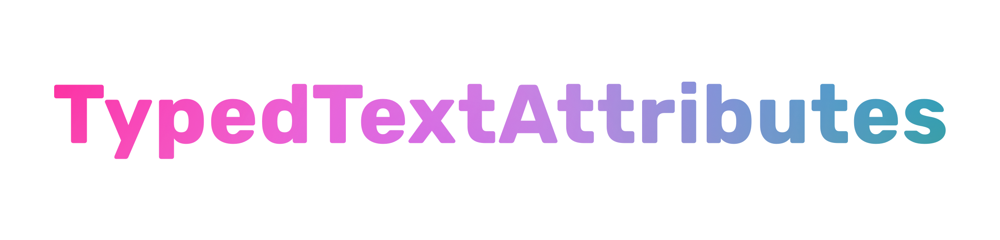

# 🖍 TypedTextAttributes

<p align="center">
  
</p>

<a href="https://developer.apple.com/swift"></a>
<a href="https://github.com/muukii/TypedTextAttributes/releases/latest"></a>
<a href="https://cocoapods.org/pods/TypedTextAttributes"></a>
<a href="https://github.com/Carthage/Carthage"></a>
</br>
<a href="https://travis-ci.org/muukii/TypedTextAttributes"></a>
<a href="https://github.com/muukii/TypedTextAttributes/blob/master/LICENSE"></a>

**The Library Creating Text Attributes with Type-Safety**<br>
**It will be helpful for creating NSAttributedString.**

💡 TypedTextAttributes is inspired by [TextAttributes](https://github.com/delba/TextAttributes).

## Usage

It's very simple sample code.

```swift
let attributedString = "Hello".attributed {
  TextAttributes()
    .font(UIFont.preferredFont(forTextStyle: .headline))
    .foregroundColor(.white)
    .alignment(.right)
}
```

We can create text-attributes with method chaining.
The methods are defined by extention for `Dictionary<NSAttributedString.Key, Any>`
So, we can also describe following.

```swift
let baseAttributes = [NSAttributedString.Key : Any]()

let attributes = baseAttributes
  .foregroundColor(.white)
  .alignment(.right)
```

And, `[NSAttributedString.Key : Any]` has typealias as `TextAttributes` in this library.

### The Methods adding attributes

- font
- foregroundColor
- backgroundColor
- underlineStyle
- underlineColor
- strikethroughStyle
- strikethroughColor
- strokeColor
- strokeWidth
- textEffect
- link
- baselineOffset
- obliqueness
- expansion
- verticalGlyphForm
- kern
- paragraphStyle
- alignment
- firstLineHeadIndent
- headIndent
- tailIndent
- lineHeightMultiple
- maximumLineHeight
- lineSpacing
- paragraphSpacing
- paragraphSpacingBefore
- lineBreakMode
- ligature
- attachment
- shadow


## Installation
### CocoaPods

[CocoaPods](http://cocoapods.org) is a dependency manager for Cocoa projects. You can install it with the following command:

```bash
$ gem install cocoapods
```

To integrate TypedTextAttributes into your Xcode project using CocoaPods, specify it in your `Podfile`:

```ruby
target 'YourApp' do
  pod 'TypedTextAttributes'
end
```

Then, run the following command:

```bash
$ pod install
```

### Carthage

[Carthage](https://github.com/Carthage/Carthage) is a decentralized dependency manager that builds your dependencies and provides you with binary frameworks.

You can install Carthage with [Homebrew](http://brew.sh/) using the following command:

```bash
$ brew update
$ brew install carthage
```

To integrate TypedTextAttributes into your Xcode project using Carthage, specify it in your `Cartfile`:

```ogdl
github "muukii/TypedTextAttributes"
```

Run `carthage update` to build the framework and drag the built `TypedTextAttributes.framework` into your Xcode project.


## Author

muukii, muukii.app@gmail.com

## License

TypedTextAttributes is available under the MIT license. See the LICENSE file for more info.
